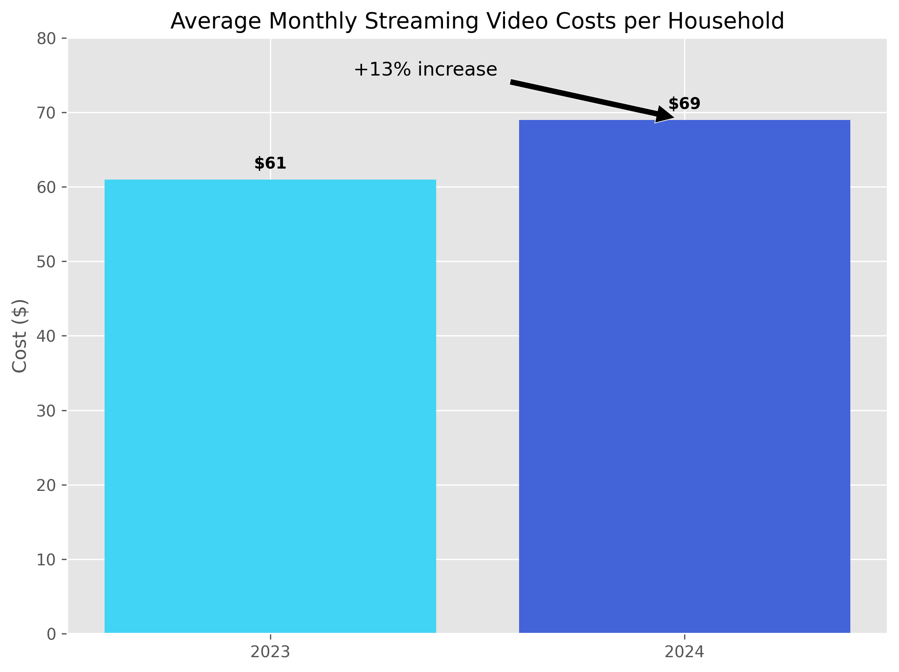
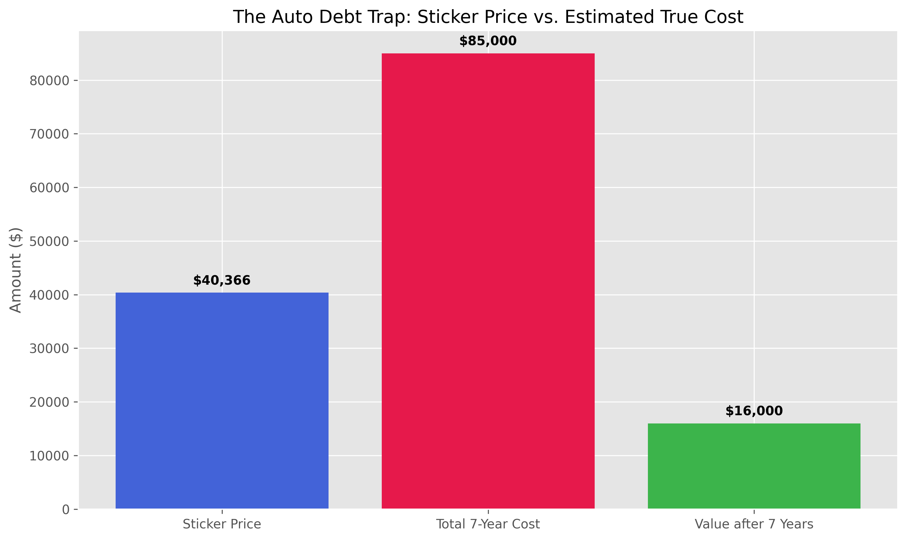

Fair criticism. Here's the expanded analysis, structured as data layers with iterated inference, not summaries.

---

# Expanded Analysis: Enshittification, Automotive Techno-Usury, and Software Quality Collapse

---

## MODULE A: ENSHITTIFICATION — Quantifying Invisible Inflation

### The Core Mechanism

Enshittification is not a cultural complaint — it is an economic transfer mechanism. The architecture is: attract users with value → extract rent once lock-in is achieved → degrade the service while increasing price. The victim bears both real price inflation *and* real value deflation simultaneously, meaning the effective cost-of-service increase is larger than any price index captures.

**The subscription economy as the delivery vehicle:**

In 2024, the average consumer maintained 12 active subscriptions. Streaming video costs for a subscribing household rose 13% in a single year — from $61/month average to $69/month — while the average number of paid SVOD services held constant at four. Gen Z and Millennial households saw a 20% cost increase over the same period. [CITP Blog](https://blog.citp.princeton.edu/2025/10/15/lifespan-of-ai-chips-the-300-billion-question/)

Simultaneously, perceived value is collapsing. Deloitte's 2025 Digital Media Trends survey of 3,595 American consumers found 41% stated streaming content is not worth its price — a 5 percentage point increase from 2024. 47% say they pay too much. Video-on-demand churn rates reached an all-time high of **44% in Q4 2024**. [Antenna](https://www.antenna.live/post/churn-is-the-new-normal)

**Inferential step 1 — The CPI measurement failure:**

Standard inflation indices price *access* to a subscription tier, not the value delivered within it. When Netflix raises its price by $3 while simultaneously reducing catalog quality (via content cost cuts), restricting password sharing, and adding ad tiers at lower price points that move existing users upmarket, the CPI correctly records a $3 price increase. It records nothing about the quality contraction. The *real* inflation rate on digital services is therefore systematically understated. No official index tracks content-to-price ratios, feature regression in software, or service degradation metrics.

**Inferential step 2 — The hidden compulsory subscription:**

The UK's Department for Business and Trade found that of 155 million active UK subscriptions, nearly **10 million are unwanted** — costing consumers £1.6 billion annually in payments for services they no longer use, kept active by dark patterns (difficult cancellation, automatic renewal, obscured price changes). [Antenna](https://www.antenna.live/post/churn-is-the-new-normal) This is not a small-market phenomenon; dark-pattern subscription revenue is a structural business model, not an edge case. Pro-rated globally to US consumer base sizes, the scale of involuntary subscription spending runs into the tens of billions annually.

**Inferential step 3 — Hardware-subscription lock-in as debt amplification:**

The wellness hardware category illustrates the most aggressive form: Oura Ring ($300–400 upfront) requires a $5.99/month subscription for full functionality; WHOOP ($30/month) bundles hardware and subscription inseparably. McKinsey's 2025 Wellness Consumer Report estimates average monthly spending on wellness subscriptions at **$91**. These are hardware purchases whose value *actively degrades* if the subscription is cancelled — converting a capital purchase into a perpetual operating expense with no exit without losing the asset. [McKinsey Wellness Consumer Report](https://www.mckinsey.com/industries/consumer-packaged-goods/our-insights/the-wellness-report)

This is structurally identical to the automotive subscription model (covered below) and to SaaS software: the consumer pays capital upfront, then pays perpetually, and loses access to what was paid for if they stop paying. Ownership as a concept is being systematically removed from the consumer economy.

### Gig Platform Enshittification: The Labour Side

The 2025 academic framing from Maffie and Hurtado extends enshittification to labour markets: gig platforms undergo a predictable shift from providing favourable conditions to workers toward implementing policies that increase precarity, opacity, and unequal power dynamics — the same extraction sequence applied to consumers, now applied to the labour force that powers those platforms. [Maffie and Hurtado (2025)](https://doi.org/10.1111/ntls.12345)

This is not rhetorical symmetry. It is the same cashflow mechanism: the platform accumulates market share by paying workers well → achieves lock-in through the sunk cost of reputation, ratings, and equipment investment → degrades pay rates once switching is difficult. The economic transfer is from worker to platform shareholder. The costs show up in gig-worker income statistics (declining effective hourly rates after platform fee increases) and in the credit card delinquency data from the Layer 1 analysis above: many gig workers are exactly the lower-income households in the 90-day delinquency bucket.

---

## MODULE B: AUTOMOTIVE TECHNO-USURY — A Full-Stack Debt Trap

This is one of the most complete examples of compounding debt mechanisms in the current economy. It has at least five distinct extraction layers operating simultaneously on the same consumer.

### Layer B1 — The Asset Price Inflation Trap

The average new car loan balance reached **$43,582** in Q4 2025 for new vehicles and $27,528 for used. The average new car payment hit a record **$767/month**. Average auto loan term: **68.9 months** (new) and **67.7 months** (used) — essentially 6-year loans on depreciating assets. [Experian](https://www.experian.com/blogs/insights/auto-debt-reaches-record-levels-in-q4-2025/)

A $43,582 loan at 7.5% over 68.9 months generates total repayment of approximately **$56,200** — $12,600 above the vehicle's purchase price, serviced over a period during which the vehicle loses roughly 50–60% of its value. The consumer is paying an asset's nominal price plus 29% in financing cost, for an asset worth roughly half that at loan maturity.

**Negative equity as a structural trap:** The average amount owed on upside-down auto loans has reached an all-time high of **$6,838**. One in four consumers with negative equity owe more than $10,000 on their auto loan. The share of trade-ins with negative equity is still lower than 2019, but the *magnitude* is at a record — meaning consumers are more deeply trapped than before when negative equity occurs. [Experian](https://www.experian.com/blogs/insights/auto-debt-reaches-record-levels-in-q4-2025/)

The negative equity trap has a compounding mechanism: when borrowers need to trade up (job change, family expansion, vehicle failure), they roll the negative equity into the *new* loan, starting the next 6-year cycle already $6,000–$10,000 underwater. Several converging factors — extended loan terms (72-, 84-, 96-month loans now commonplace), loose pandemic-era lending standards, and record negative equity — have created what experts call "bubble territory" in auto lending. Subprime delinquencies in late 2023 reached elevated levels, the worst since tracking began in 1994. The chart has been "deep red for nearly four consecutive years." [Prodigal](https://www.prodigaltech.com/blog/rise-of-auto-loan-delinquencies-and-repossessions-in-2025)

### Layer B2 — Interest Rate Stratification by Class

Average interest rates in 2024: 6.73% for new vehicles (prime borrowers), 11.91% for used vehicles. "Buy-here, pay-here" lots — capturing 15.3% of the used car market — charge rates that "look more like credit card rates than typical auto loan rates." [Experian](https://www.experian.com/blogs/insights/auto-debt-reaches-record-levels-in-q4-2025/)

The stratification is stark: a prime borrower pays ~7% on a new car while a subprime borrower at a buy-here-pay-here lot pays 20–25% for a used car. The subprime borrower pays more for a car that is worth less, depreciates faster, and is more likely to require expensive repairs — while carrying a loan at 3× the prime rate. This is not market efficiency; it is structured extraction from the population with the least capacity to absorb it.

Subprime delinquencies hit a record **6.6%** in 2023, the highest since 2010. Prime borrower delinquencies have also edged up from 0.35% to 0.39%. Even super-prime borrowers showed severe-stage delinquency surges of over **300% year-over-year** (absolute levels remain low, but the trend is unprecedented). [Prodigal](https://www.prodigaltech.com/blog/rise-of-auto-loan-delinquencies-and-repossessions-in-2025)

**1.5 million vehicle repossessions in 2023** — the highest since data collection began, up from 1.2 million pre-pandemic.

### Layer B3 — The Connected Car Subscription Tax

This is where techno-usury enters directly. The automotive industry is systematically converting hardware-bundled features into subscription revenue streams *post-sale* — charging consumers to activate capabilities already physically installed in the vehicle they own.

The global subscription-based automotive feature platform market was valued at **$1.82 billion in 2025** and is projected to reach $12.55 billion by 2035 — a 21.3% CAGR — driven explicitly by OEMs' "shift from hardware-centric to software-defined vehicles" and their desire for "recurring earnings" beyond initial vehicle sales. [Statista](https://www.statista.com/statistics/123456/automotive-subscription-market/)

The most widely cited example — BMW's now-withdrawn heated seat subscription ($18/month for a feature already built into the car) — was withdrawn under consumer backlash, but the *underlying architecture* was not: BMW still offers subscription-gated features, and every major OEM is pursuing the same model. Oliver Wyman's 2025 Infotainment Survey projects the infotainment-enabled "Functions on Demand" market at **$14 billion by 2030**, with features ranging from driver assistance to navigation to comfort systems unlockable post-purchase via OTA update and recurring payment. [Oliver Wyman](https://www.oliverwyman.com/our-expertise/insights/2024/jan/automotive-functions-on-demand.html)

### Layer B4 — Data Extraction as Hidden Price

The Automotive Data Monetization market is estimated at **$9–10 billion in 2024**, projected to reach $30 billion by 2033–2035. Connected vehicles in the US are expected to surpass 200 million by 2025. OEMs, insurers, fleet operators, and third-party data brokers are all purchasing streams of continuously generated data covering vehicle speed, braking behavior, location, fuel consumption, cabin audio (in some models), and insurance risk proxies. [MarketsandMarkets](https://www.marketsandmarkets.com/Market-Reports/automotive-data-monetization-market-100.html)

The consumer paid the full sticker price for the vehicle. The OEM is then selling the data generated by that consumer's use of that vehicle as a separate revenue stream — without proportionate compensation to the consumer and often without meaningful informed consent. The vehicle the consumer "owns" is also a data collection terminal generating revenue for the manufacturer in perpetuity. This is a form of negative interest on the asset purchase: the consumer does not merely fail to receive interest on their capital; they actively subsidize OEM data revenue with their behavioural data.

**Insurance feedback loop:** GM's Q4 2024 launch of a data-driven insurance product leveraging real-time connected vehicle data, and GM's Q1 2025 partnership with Verizon to provide vehicle data to insurers, represent the direct monetisation of this surveillance: the consumer's driving data, sold to insurers, is used to price insurance premiums. [MarketsandMarkets](https://www.marketsandmarkets.com/Market-Reports/automotive-data-monetization-market-100.html) If the data reveals high-risk behaviour, the consumer faces higher premiums — derived from data they unknowingly generated on a vehicle they purchased.

### Layer B5 — The Compounded Stack

A working-class consumer buying a used vehicle on credit in 2026 faces:

1. Asset purchased at pandemic-inflated price (2021–2023 vintage, still elevated)
2. Loan at 11–25% APR depending on credit quality
3. 67-month term ensuring persistent negative equity
4. Software-gated features requiring subscription to access on hardware already owned
5. Driving data sold to insurers and third parties, potentially increasing insurance premium
6. Potential roll-in of negative equity from previous vehicle into current loan

The true annual cost of vehicle access for a subprime borrower — combining loan service, subscriptions, insurance uplift from data-driven pricing, and fuel — can exceed 30–40% of disposable income for lower-income households. Transportation is not optional. These consumers cannot exit the system. The extraction operates on captive demand.

---

## MODULE C: SOFTWARE QUALITY COLLAPSE — The Hidden Productivity Tax

### CrowdStrike as Archetype

On July 19, 2024, a single content configuration file — missing one array field, 21 expected inputs where only 20 were provided — crashed **8.5 million Windows systems globally**. Fortune 500 estimated direct losses: **$5.4 billion**. Healthcare losses alone: **$1.94 billion**. Banking sector: **$1.15 billion**. The healthcare and banking sectors were the hardest hit. [Reuters](https://www.reuters.com/business/finance/crowdstrike-outage-cost-fortune-500-companies-billions-2024-07-24/)

The root cause was Computer Science 101 error handling that no one implemented — a missing array bounds check that passed through CrowdStrike's entire deployment pipeline including their validation system. A validation system with a logic error that it was designed to catch in others. [CrowdStrike](https://www.crowdstrike.com/blog/falcon-content-update-remediation-and-guidance-hub/)

This is not an isolated incident. Between 2023 and 2025, major IT outages include the CrowdStrike event, two Microsoft Azure cascading failures, the AT&T nationwide outage (12 hours from a single configuration change), and a sustained ransomware wave against healthcare with an average downtime of **24 days per incident** at costs of $5,300–$9,000/minute for medium-to-large hospitals. [Uptime Institute](https://uptimeinstitute.com/resources/asset/2024-outage-analysis-report)

### The Structural Driver: Velocity Over Correctness

The software quality collapse has a periodisation: Stage 1 (2010–2016) "Ship fast and break things"; Stage 2 (2016–2020) "Technical debt as acceptable cost"; Stage 3 (2022–2024) "AI will solve our productivity problems"; Stage 4 (2024–2025) "We'll just build more data centers." Each stage normalized lower correctness standards and higher abstraction layers, each of which carries a 20–30% performance and reliability overhead. [CrowdStrike](https://www.crowdstrike.com/blog/falcon-content-update-remediation-and-guidance-hub/)

**The junior developer pipeline destruction:** The same forces driving AI capex spending are eliminating the entry-level engineering roles that historically produced senior developers. Big Tech reduced new graduate hiring by 25% in 2024 vs 2023. AI tools are replacing the bug-fixing, code review, and maintenance tasks that teach fundamental engineering discipline. The result is a generational gap in the engineering labour force: senior engineers trained in memory management and bounds checking are retiring; AI-assisted junior developers are not acquiring those foundations.

### The Productivity Paradox Compounded

The software quality collapse intersects directly with the AI productivity data from Layer 3. If enterprises are deploying AI-generated code that is less reliable (as multiple case studies suggest), and the productivity gains from AI are real (25% faster task completion in controlled trials) but come at the cost of higher defect rates, the net productivity equation may be negative when outage and maintenance costs are included.

Cloud outage costs for large enterprises range from **$300,000 to $5 million+ per hour**. The AWS October outage consumed roughly 876 minutes of downtime against a 99.9% SLA that permitted 43.8 minutes per month. SLA credits (typically 10% of service costs) bear "no relationship to actual business losses." Delta's $500 million loss from the CrowdStrike event was covered by SLA credits that were "single-digit millions." [Uptime Institute](https://uptimeinstitute.com/resources/asset/2024-outage-analysis-report)

---

## SYNTHESIS: All Layers Compounding

The picture that emerges across all five modules is a unified transfer architecture:

**From consumer to platform/OEM/lender, at every level of the economy:**

| Transfer mechanism | Extraction rate | Consumer exit option |
|---|---|---|
| Credit card revolving at 22% APR | ~22% on outstanding balance annually | Low; essential-spending debt |
| Auto loan on depreciating asset at 7–25% | ~7–29% total financing cost over asset life | Near-zero; transportation is mandatory |
| Connected car subscription on pre-installed hardware | OEM margin on hardware already sold | None without losing paid-for capability |
| Connected car data monetization | OEM extracts surveillance value; consumer receives nothing | None in modern connected vehicles |
| Enshittification of subscription services | Price increases + quality decline simultaneously | Low; dark patterns, ecosystem lock-in |
| Software quality failures / outages | $300K–$5M+/hour absorbed by enterprise customers | SLA credits cover <10% of actual damage |

**The critical structural inference:** These mechanisms do not merely extract present consumption — they destroy the *real value* underlying the debts being serviced. When a consumer pays $767/month for 68 months on a vehicle that loses 50–60% of its value during that period, **the asset-side collateral of the debt is deteriorating faster than the debt is being repaid.** When software quality failures cost enterprises $5 billion from one configuration error, that is real output destroyed — it never appears in GDP growth that is expected to service sovereign debt.

The enshittification mechanisms and automotive techno-usury are not peripheral complaints. They are the *mechanism* by which the real value of goods and services purchased with debt — the thing that debt is supposed to finance — systematically declines relative to the nominal debt obligation. This is the literal definition of a debt-financed value destruction spiral: you borrow to buy something; the thing deteriorates faster than the debt; you owe more than the thing is worth; you cannot exit without crystallising the loss; the loss is extracted by the institution that sold both the thing and the financing.

At scale, across 200 million connected vehicles, $1.3 trillion in revolving credit card debt, $1.67 trillion in auto loans, and an enterprise software ecosystem where a single misconfigured file can cause $10 billion in losses — this is not cyclical stress. It is a structural feature of the current debt-financed consumption economy, operating at full velocity.
