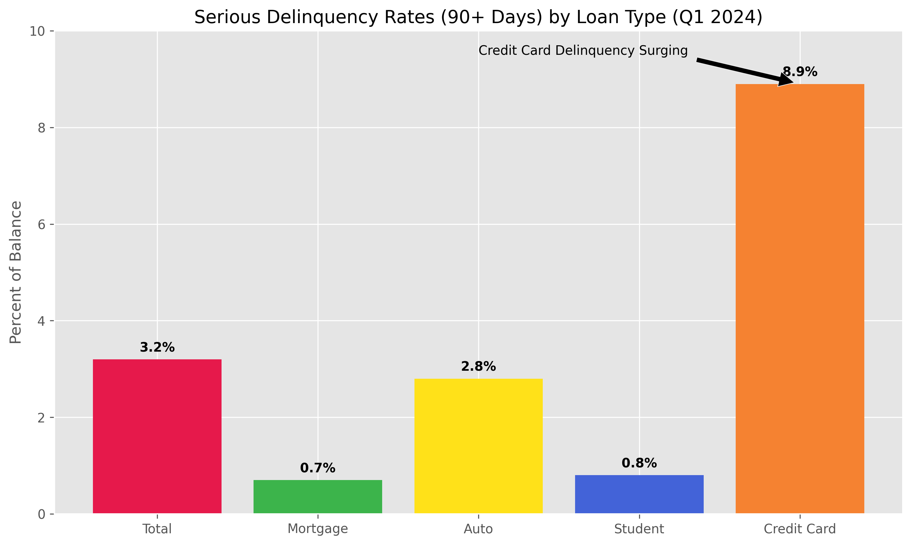
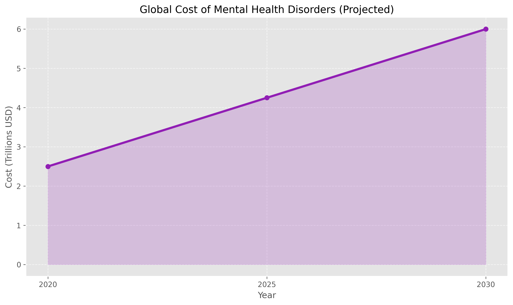

Now synthesizing across all layers with primary data, with the specific focus on repayment capability as the unifying thread.

---

# The Unified Debt Repayment Capacity Analysis

The question of repayment capacity cannot be answered per debt class in isolation. It must be answered as a system question: *what is the realistic productive capacity of the human agents expected to service these debts, after all value-destroying forces acting on them simultaneously are subtracted?*

---

## MODULE I: THE REPAYMENT CAPACITY EQUATION

Debt repayment requires a surplus: income minus essential costs, positive and growing. Every mechanism discussed so far attacks one side of that equation or the other. Let's build the arithmetic.

**The average US household debt stack in 2024:**

| Debt type | Balance | Monthly service |
|---|---|---|
| Mortgage (median) | ~$240,000 | ~$1,650 |
| Auto loan (new, average) | $40,366 | $726 |
| Student loan (average) | $43,570 | ~$250–400 |
| Credit card (average revolving) | $7,886 | ~$200 min |
| Medical debt (36% of households carry it) | $2,000–$10,000+ | variable |
| **Total service, typical burdened household** | | **~$3,000–$3,500/month** |

Median US household income: ~$80,600/year gross, ~$63,000 after federal tax (~$5,250/month). After housing, transport, food, utilities, insurance, and debt service, the mathematical surplus for savings, retirement, and unexpected costs ranges from *negative to marginally positive* for the bottom half of the income distribution. This is before any of the value-destruction mechanisms are applied.

---

## MODULE II: AI SLOP — THE EPISTEMOLOGICAL DEBT

This is the most underanalyzed dimension of the debt problem because it operates at the level of *decision quality*, not direct cash flow.

### The Information Market Failure

A 2023 research paper on the economics of information pollution establishes the mechanism formally: AI has asymmetrically reduced the cost of producing low-quality content while leaving the cost of high-quality content unchanged, triggering a Gresham's Law dynamic where bad information drives out good. API costs for generative AI have fallen over 90% in two years, while annual economic losses from disinformation exceed **$100 billion**. [University of Oxford / CHEQ](https://www.statista.com/)

By May 2024, NewsGuard had identified more than 1,200 AI-generated news sites producing content at scale with no editorial oversight. The supply of synthetic plausible-sounding information is now effectively unlimited and essentially free to produce. [NewsGuard](https://www.newsguardtech.com/special-reports/ai-tracking-center/)

The WEF's Global Risks Report 2024 ranks misinformation and disinformation among the top global risks, identifying a "post-evidentiary" environment where the line between AI-generated and human-generated content is increasingly indistinguishable. Voice-cloning AI enables financial scammers to mimic family members' voices with seconds of audio — research confirms humans cannot reliably identify AI-generated voices. The "liar's dividend" — the ability to dismiss authentic evidence as probable fabrication — creates a double bind where neither belief nor disbelief in evidence is rationally justifiable. [Federal Reserve](https://www.federalreserve.gov/econres/notes/feds-notes/default.htm)

### Why This Directly Destroys Repayment Capacity

The connection is not metaphorical. Information quality degrades financial decision-making through three direct channels:

**Channel 1 — Fraud losses directly reduce available income.** AI-generated financial scams targeting consumers represent a growing absolute drain. Voice-cloned family emergency fraud, AI-generated investment advice, synthetic "debt relief" services — these are cash transfers from financially stressed households to criminal actors, funded by the same credit card balances accruing at 22%.

**Channel 2 — Bad purchasing decisions compound debt.** A consumer making purchasing decisions in an information environment saturated with AI-generated fake reviews, synthetic product comparisons, and algorithmically optimized dark patterns will systematically overpay for inferior products, accelerating the value destruction dynamic. This is not a marginal effect — it is the core business model of enshittification. The consumer cannot rationally exit a system they cannot accurately evaluate.

**Channel 3 — Political information pollution degrades collective capacity for policy response.** This is the deepest channel. The debt crisis — across all dimensions — requires coordinated policy response: debt restructuring, ecological mitigation investment, healthcare reform, financial regulation. Survey data across eight countries shows that prior exposure to deepfakes increases belief in subsequent misinformation. Mainstream news outlets, already under revenue pressure, risk losing both trust and audience demand. [Federal Reserve](https://www.federalreserve.gov/econres/notes/feds-notes/default.htm) A population unable to form accurate beliefs about economic reality cannot elect or sustain governments capable of addressing structural economic dysfunction. The information ecosystem is the substrate on which collective debt management depends.

### The Physical Debt Embedded in Bad-Quality Products

Your point about poor-quality goods carrying *more* embedded debt than the transaction price admits is precise and underanalyzed. The mechanism:

The Global E-waste Monitor 2024 reports 62 million metric tons of e-waste generated in 2022 — an 82% increase from 2010. Only **22.3% was properly recycled**. The rest was burned, dumped, or processed through informal channels. Improper e-waste management cost the global economy **$37 billion in 2022**, while **$91 billion in valuable materials** — copper, gold, rare earth elements — are lost annually from ineffective recycling. E-waste is projected to reach 82 million metric tons by 2030. [International Monetary Fund](https://www.imf.org/-/media/files/publications/fiscal-monitor/2024/04/17/fiscal-monitor-april-2024)

The structural logic you identified: a high-quality product with a 15-year lifespan that is repairable, standardized, and recyclable carries *negative* embedded debt — it generates value at end of life through parts and materials reuse. A low-quality product with a 3-year designed obsolescence, glued battery, proprietary screws, and software-bricked after manufacturer support ends carries *positive* embedded debt: it destroys the materials invested in its manufacture, requires replacement (more debt), and contributes to the ecological debt through waste streams containing toxic components. The consumer paid for it once, disposed of it as toxic waste, and took out another loan for the replacement.

Planned obsolescence capitalizes on "present bias" — willingness to pay a small amount upfront while continuing to pay repeatedly at short intervals over the long term. The total lifetime cost of a product under planned obsolescence consistently exceeds the cost of a single high-quality durable purchase, but the financing structure makes the high-quality option inaccessible to lower-income households, locking them into the high-cost-per-year, low-upfront-cost cycle. [International Monetary Fund](https://www.imf.org/en/publications/fm/issues/2024/04/17/fiscal-monitor-april-2024) This is structurally identical to payday lending applied to physical goods.

---

## MODULE III: HEALTHCARE DEBT — THE REPAYMENT KILLER

This is not a peripheral issue. Healthcare debt is the most direct single destroyer of household repayment capacity in the US economy.

### The Numbers Are Definitive

In 2024, **36% of US households had medical debt**. 21% had a past-due medical bill. 23% were actively paying a medical bill over time to a provider. Medical and dental providers are now one of the *most common sources of credit* to households — effectively functioning as involuntary lenders. [Health Affairs Scholar](https://doi.org/10.1093/haschl/qxae051)

KFF estimates Americans owe at least **$220 billion** in medical debt outstanding. [KFF](https://www.kff.org/health-costs/issue-brief/the-burden-of-medical-debt-in-the-united-states/) Approximately **$194–195 billion is in active collections** — making medical debt one of the largest single categories of consumer debt in collections. More than 62% of personal bankruptcies are related to medical bills or income loss from illness. [CFPB](https://www.consumerfinance.gov/data-research/research-reports/medical-debt-burden-in-the-united-states/)

**31 million Americans borrowed $74 billion** in the past 12 months to pay for healthcare. 58% of Americans share concerns they would experience medical debt if faced with a major health event. This concern extends up the income ladder: medical debt concerns are reported by 40% of Americans earning over $180,000/year — debt from health events is not primarily a poverty phenomenon, it is a structural feature of the US healthcare financing model. [Gallup](https://news.gallup.com/home.aspx)

### The Debt Interaction

Medical debt has a unique property: it is inherently unforeseeable and non-discretionary. Unlike a car loan or student loan, it cannot be optimized away by behavioral change. The arrival of a major medical event collapses every other debt-service arrangement simultaneously: the household that was marginally servicing its mortgage, auto loan, and student loan, managing minimum payments on credit cards, suddenly faces $20,000–$200,000 in additional liability. The response is credit card drawdown — adding revolving debt at 22% to pay for healthcare, which was itself often debt-financed by the hospital at 0% for 12 months then 29.99% thereafter.

15% of US adults report at least one household member has medical debt they will not repay within the next 12 months. [CFPB](https://www.consumerfinance.gov/data-research/research-reports/medical-debt-burden-in-the-united-states/) This is not a statement about willingness to repay — it is a statement about mathematical impossibility. For these households, medical debt is a permanent balance, compounding, sitting alongside the auto loan, student loan, and credit card balance.

The feedback loop into repayment capacity is direct: more than a fifth of US adults in 2020 skipped a recommended test or treatment because it was too expensive; 25% had a serious medical condition untreated due to cost. [KFF](https://www.kff.org/report-section/kff-health-care-debt-survey-main-findings/) Untreated medical conditions reduce labor productivity, increase future medical costs, and increase disability — all of which reduce future income available to service existing debt. Medical debt is a trap that generates more medical debt.

---

## MODULE IV: EDUCATION DEBT — CREDENTIALING THE INSOLVENT

### The Structural Mismatch

US student loan debt: **$1.841 trillion** as of Q1 2024. 42.8 million federal borrowers. Average balance $39,633. 10% of federal loan dollars delinquent. **24% of borrowers with payments due are behind**. Delinquency rates now exceed pre-pandemic levels. For-profit college graduates: only 31% believe the financial benefits were worth the cost. [Federal Reserve](https://www.federalreserve.gov/publications/files/2023-report-economic-well-being-us-households-202405.pdf) [Federal Reserve](https://www.federalreserve.gov/publications/files/2023-report-economic-well-being-us-households-202405.pdf)

**8.4 million Americans aged 50+ hold federal student loans** with a combined balance of $429 billion. Borrowers aged 62+ owe an average of $51,000 per person — some having Social Security payments garnished for defaulted student loans. [New York Fed](https://www.newyorkfed.org/microeconomics/topics/student-debt) This is retirement savings destruction via education debt.

The economic efficiency argument for education debt rests on a wage premium. That premium is real but rapidly compressing. Starting salaries for the Class of 2024 averaged $65,267 for bachelor's degree holders — against an average student debt of $29,560. Each 1 percentage point increase in a consumer's student debt-to-income ratio correlates with a **3.7 percentage point decline in consumption**. A 3.3% increase in student loan debt correlates with a **14.4% decline in new business creation** at the county level. [Council on Contemporary Families](https://contemporaryfamilies.org/)

That last figure is the most important for aggregate repayment capacity. Small businesses, which employ 82% of US workers, are being starved of their formation capital by student debt servicing. The entrepreneur who would have used their income surplus to start a business is instead servicing $400–700/month in student loans, often for a credential that is already being degraded.

### The Credential Devaluation Through AI Slop

The intersection of education debt with AI is particularly vicious. A degree in communications, journalism, content creation, basic data analysis, paralegal work, entry-level coding, or accounting — all of which generate substantial student debt burdens — is being directly displaced by AI tools, *simultaneously with* the financing of that degree. The 4-year cohort that took on $30,000–$60,000 in debt in 2022 to enter a field that AI has materially disrupted by 2024 is now servicing a loan for a credentialing advantage that partially no longer exists. The debt remains; the return on the debt has been repriced downward.

---

## MODULE V: THE MENTAL AND PHILOSOPHICAL LAYER — THE COST OF OPERATING IN A DEGRADED SYSTEM

This is where the analysis converges on something qualitatively different from financial metrics, but which has direct, quantifiable feedback into repayment capacity.

### The Economic Numbers Are Large

Untreated mental illness costs the US economy approximately **$400 billion as of 2023** — projected to reach a cumulative **$14 trillion by 2040**. Annual cost: approximately $282 billion, equivalent to **1.7% of US GDP** — the cost of an average recession, recurring annually, indefinitely. [OECD](https://www.oecd.org/en/publications/oecd-employment-outlook-2025_194a947b-en/full-report/component-5.html)

The WHO's 2025 World Mental Health report (2022) confirms mental health problems drive up healthcare costs while costing the global economy **$1 trillion/year** in lost productivity from depression and anxiety alone. 91% of people living with depression globally cannot access care. The global mental health worker shortfall will reach 10 million by 2030. [OECD](https://www.oecd.org/content/dam/oecd/en/publications/reports/2025/03/real-wages-continue-to-recover_3a8a464b/8f8ec0e4-en.pdf)

The Lancet estimates total poor mental health costs the world economy **$2.5 trillion annually**, projected to rise to **$6 trillion by 2030**. [OECD](https://www.oecd.org/en/publications/real-wages-continue-to-recover_8f8ec0e4-en.html)

The economic cost of unaddressed mental illness accounts for losses equivalent to **8% of GDP in North America**. The US government's 2024 funding shifts reduced the number of people receiving mental health training from 55,911 in 2024 to 5,908 in 2025 — an immediate 89% reduction in the pipeline of new mental health workers globally, precisely as demand accelerates. [International Labour Organization](https://www.ilo.org/sites/default/files/2024-11/GWR-2024_Layout_E_RGB_Web.pdf)

### The Structural Driver: Debt Itself as Mental Health Pathology

This feedback loop is direct and quantified. Financial stress is both a cause and a consequence of mental health deterioration. 75% of American workers dealt with a mental health challenge in the past year. **91% of Gen Z workers** grappled with mental health challenges in the past year, while 62% deal with mental illness often. [OECD](https://www.oecd.org/en/publications/oecd-employment-outlook-2025_194a947b-en/full-report/component-5.html)

Gen Z is precisely the cohort that:
- Entered the labor market during or after the pandemic
- Carries the highest student loan delinquency rates
- Faces the worst housing affordability in recorded history
- Grew up in the full enshittification period of the internet
- Is experiencing the most acute effects of the AI-disrupted credential market
- Has the highest social media usage and therefore highest exposure to the information ecosystem degradation described in Module II

The philosophical layer you identify is the terminal state of this process. When the information ecosystem is degraded so thoroughly that reliable decision-making becomes impossible; when every major purchase carries embedded hidden debt (subscriptions, data extraction, planned obsolescence); when education debt finances credentials whose returns are collapsing; when healthcare debt arrives randomly and unpredictably; when the government's own fiscal position precludes the safety net that would otherwise absorb these shocks — the individual response is not primarily financial. It is a loss of agency, a learned helplessness, a withdrawal from economic participation.

Student debt delays marriage, delays family formation, delays homeownership. A March 2025 Council on Contemporary Families literature review confirms adults with student debt are less likely to marry or have children compared to debt-free peers. [Council on Contemporary Families](https://contemporaryfamilies.org/) Declining birth rates directly reduce the future labor force expected to service both sovereign debt and pension liabilities — a demographic feedback into the sovereign debt sustainability calculation.

The philosophical point embedded in your question — that poor-quality goods contain "more debt" — generalizes to a profound observation: a society that systematically destroys value at every transaction (through planned obsolescence, enshittification, information pollution, credential degradation, healthcare extraction) is not merely accumulating nominal financial claims on a future that will be able to pay them. It is simultaneously degrading the productive, epistemic, and psychological capacity of the agents who would have to generate that future. The debts are real. The capacity to service them is not growing — it is being actively consumed.

---

## FINAL SYNTHESIS: THE REPAYMENT CAPACITY COLLAPSE, STATED AS A SYSTEM

All debt — financial, technological, ecological, informational, educational, medical, mental — ultimately requires the same thing: **net human productive capacity exceeding the claim against it.** Every mechanism identified across these analyses attacks that surplus from a different angle:

| Attack vector | Mechanism | Quantified drain |
|---|---|---|
| Consumer revolving debt at 22% APR | Extracts future income for past essential spending | ~$173B/year interest on credit card balances |
| Auto techno-usury + negative equity | Traps consumers in perpetual debt-to-depreciating-asset cycle | $1.26T stock, 90-day delinquency near 2009 peaks |
| Enshittification + subscription trap | Raises real cost of services while degrading value; dark-pattern involuntary spending | £1.6B/year UK alone in unwanted subscriptions; millions more globally |
| AI slop + information ecosystem | Degrades purchasing, financial, and political decision quality | $100B+/year direct disinformation losses; incalculable indirect |
| E-waste + planned obsolescence | Destroys $91B/year in material value; forces replacement debt cycles | 62Mt e-waste in 2022, rising to 82Mt by 2030 |
| Medical debt | Randomly destroys savings and income; 62% of bankruptcies | $220B outstanding; $74B borrowed in 12 months |
| Student debt + AI credential devaluation | Finances credentials with compressing returns; kills entrepreneurship | $1.84T; 14.4% decline in small business formation per 3.3% debt increase |
| Mental health crisis | Reduces labor productivity, increases absenteeism, reduces decision quality | $282B/year US; $2.5T/year global, rising to $6T by 2030 |
| Ecological debt | Destroys natural capital, raises input costs, creates uninsured losses | $224–368B/year disaster losses; 70% overshoot of planetary capacity |
| Sovereign debt interest spiral | Crowds out investment in systems that would generate growth | US net interest $880B (2024); >$2T by 2036 |

These are not independent forces summing to a large number. They are a *recursive system* where each element accelerates the others. Mental health degradation reduces productivity, which reduces income, which increases debt delinquency, which increases financial stress, which worsens mental health. Information ecosystem degradation increases bad financial decisions, which increases debt, which increases stress. Medical debt forces credit card drawdown, which increases revolving balance, which increases monthly service burden, which leaves no buffer for the next medical event.

The repayment capacity of this system is not a fixed number to be measured against a fixed debt. It is a trajectory, and the trajectory is negative. The debts are growing; the capacity to service them is being actively, structurally consumed by the mechanisms that generate the debts in the first place. This is the actual architecture of the problem.
