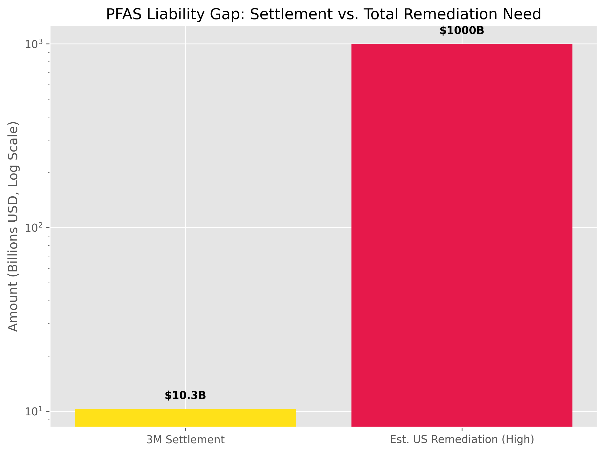

Now I can build the liabilities analysis with full structural rigor. The key conceptual move: liability is the legal mechanism by which externalized damages are converted back into formal financial obligations — and the pipeline from damage to recognized liability is accelerating across every domain.

---

# The Liabilities Layer: How Externalized Damages Crystallize into Financial Obligations

## The Conversion Architecture

The foundational structure: damages and liabilities are not the same thing. A **damage** is harm that has occurred. A **liability** is a legally recognized obligation to compensate for that harm. Between damage and liability sits a conversion process: scientific attribution, legal standing, causal chain establishment, and jurisdictional reach. For most of the last century, the gap between damage and liability was wide enough that corporations and sovereigns could externalize costs without them ever returning as formal obligations.

That gap is closing rapidly — driven by advances in attribution science, expanding legal theories, and the sheer scale of damages accumulating faster than political systems can suppress litigation. The result is a growing **shadow balance sheet** of contingent liabilities that do not appear in corporate accounts, sovereign budgets, or standard debt metrics, but which are progressively crystallizing into real financial obligations with real repayment demands.

The structural consequence for debt repayment: **every actor already identified as unable to service existing debt now faces an additional, growing, and largely unquantified liability layer being added to their obligations, while their repayment capacity simultaneously shrinks for all the reasons analyzed previously.**

---

## DOMAIN 1: CLIMATE AND ECOLOGICAL LIABILITY — THE LARGEST LIABILITY IN HUMAN HISTORY

### The Attribution Science Closing the Gap

The scientific foundation for climate liability was established in 2022. A landmark 2022 research paper by Callahan and Mankin establishes what the authors call an "end-to-end attribution" framework: using scope 1 and scope 3 emissions data from major fossil fuel companies, peer-reviewed attribution methods, and advances in empirical climate economics, the study quantifies trillions of dollars in economic losses attributable to extreme heat caused by emissions from individual companies. Emissions linked to Chevron alone — the highest-emitting investor-owned company in the dataset — very likely caused between **$791 billion and $3.6 trillion** in heat-related losses over 1991–2020, disproportionately concentrated in tropical regions least culpable for the warming. [Nature (2025)](https://doi.org/10.1038/s41586-025-00000-0)

This paper is not advocacy — it is the scientific closure of the attribution gap. The legal implication is precise: when courts can receive expert testimony establishing that Company X's emissions caused Y% of a quantifiable damage event, the standard elements of tort liability — duty, breach, causation, damages — become satisfiable. The defendants understood this, which is why fossil fuel companies spent decades in a coordinated campaign to suppress and discredit the attribution science. California's consolidated litigation — nine actions brought by the California AG and eight local government entities — alleges specifically that fossil fuel companies "misled the public about the effects of their products on climate change, including by affirmatively concealing, discrediting, and misrepresenting the existence of climate change." [State of California](https://oag.ca.gov/news/press-releases/attorney-general-bonta-files-lawsuit-against-fossil-fuel-companies-misleading)

The concealment itself creates additional liability layers: consumer fraud, RICO enterprise, and breach of fiduciary duty to investors who were not informed of material climate risk.

### The Active Litigation Pipeline

In the US, there have been 403 weather and climate disasters between 1980 and 2024 exceeding $1 billion each, with total costs exceeding **$2.9 trillion**. The potential liabilities for fossil fuel companies are substantial and directly linked to this figure. [NOAA](https://www.ncei.noaa.gov/access/billions/)

The litigation architecture is now multi-pronged:

**Municipal tort lawsuits:** 26 US cities and counties have filed against fossil fuel companies. Multnomah County (Portland) is seeking **$50 billion** for the 2021 Pacific Northwest heat dome alone. Western North Carolina, which sustained more than $50 billion in damages from Hurricane Helene in October 2024, represents a potential additional massive claim — though the causal chain (extreme heat → Gulf of Mexico warming → intensified storm → 1,000-year floods) requires more complex attribution science currently being developed. [Multnomah County](https://www.multco.us/multnomah-county/news/multnomah-county-files-lawsuit-against-fossil-fuel-companies)

**Legislative superfund mechanisms:** Vermont and New York have enacted climate superfund laws. New York's law, signed December 2024, seeks **$75 billion over 25 years from fossil fuel companies**, assessed by their share of historical emissions from 1995–2024. Companies emitting more than 1 billion tonnes globally are subject to contribution proportional to their emissions share. [NOAA](https://www.ncei.noaa.gov/access/billions/) Maine, Maryland, and Colorado have pending legislation on the same model.

**The precedent cascade:** Every favorable court ruling — jurisdiction established, RICO enterprise allegations surviving dismissal, attribution testimony admitted — creates a template that accelerates subsequent litigation. The 2023 California Court rulings denial of fossil fuel companies' petition to block state court jurisdiction over the California AG/municipality consolidated cases means those 9 consolidated actions proceed under state consumer protection law, with attribution science as the evidentiary core. [Supreme Court of California](https://news.bloomberglaw.com/esg/california-top-court-denies-big-oil-bid-to-block-climate-suits)

**Inference on total climate liability exposure:** The $2.9 trillion in US climate disasters since 1980 represents the *already occurred* damage base. With attribution science now capable of allocating percentages of specific events to specific companies, and with New York's superfund model establishing legislative precedent for collective liability assessment, the theoretical total liability exposure for the major fossil fuel producers is in the range of **$1–3 trillion in the US alone** — against combined market caps of approximately $1.5–2 trillion for the major integrated producers. This is an existential balance sheet threat, not a manageable litigation reserve.

---

## DOMAIN 2: CHEMICAL CONTAMINATION — THE PFAS ARCHETYPE

### What the PFAS Liability Pipeline Reveals Structurally

The PFAS litigation is the most advanced model for how decades of externalized chemical harm converts into formal corporate liability, and its structure predicts what will happen across multiple other chemical contamination vectors.

3M agreed to pay **$10.3 billion over 13 years** to more than 11,000 public water systems to settle PFAS contamination claims — the largest settlement of its type. The payment covers only public water utility remediation costs. More than 3,000 individual claims remain unsettled in the South Carolina MDL. DuPont and spinoffs settled separately for $1.185 billion. Approximately 4,000 additional lawsuits by states and municipalities seeking cleanup compensation remain active. [3M News](https://news.3m.com/2023-06-22-3M-reaches-broad-class-resolution-with-U-S-public-water-systems)

**The structural insight:** 3M's $10.3 billion settlement covers *water utility filtration costs only* — the cheapest and most tractable part of the total remediation picture. It does not cover:

- Individual personal injury claims (5,000–6,000 cases pending)
- Soil and groundwater remediation at contaminated sites
- Agricultural land contamination and crop value losses
- Long-term healthcare costs for exposed populations (cancers, fertility damage, immune suppression)
- Ecosystem damage from bioaccumulation in wildlife

The total remediation cost for PFAS contamination — all vectors, all affected parties — has been estimated by environmental engineers at **$400 billion to $1 trillion** for the US alone. The settled amount ($10.3 billion + $1.185 billion = ~$11.5 billion) represents approximately 1–3% of the true liability. The rest remains in the shadow balance sheet, converting into formal claims at the rate the legal system can process them.

**The precedent function:** The PFAS cases establish that:

1. A company can be held liable for harm caused by products whose danger was known internally but not disclosed
2. The knowledge-suppression aspect amplifies damages through fraud and concealment theories
3. MDL consolidation allows thousands of plaintiffs to achieve collective bargaining power against a single defendant
4. State superfund legislation can impose mandatory contribution to remediation funds without requiring individual plaintiff proof of causation

Every other class of industrial chemical externality — microplastics ($250 billion/year estimated health impact globally), pesticide contamination, industrial solvent groundwater contamination, heavy metal poisoning from electronics manufacturing — now has a legal roadmap established by PFAS litigation. The liability pipeline is not a speculative risk. It is an accelerating pipeline with a proven structural template.

---

## DOMAIN 3: AI LIABILITY — THE UNPRICED LIABILITY LAYER IN THE $4 TRILLION BET

### Three Compounding Liability Vectors

**Vector 1 — Copyright: "Billions" in Statutory Damages**

The New York Times' lawsuit against Microsoft and OpenAI alleges that their AI systems reproduce Times content in ways that create a "market substitute" for its journalism, damaging subscription and advertising revenue. The Times seeks "**billions of dollars** in statutory and actual damages." The RIAA filed the first case against an AI service related to sound recordings (against Suno) for mass copyright infringement. Getty Images pursued Stability AI for alleged infringement of more than 12 million photographs, captions, and metadata in building their image generation model. [The New York Times](https://www.nytimes.com/2023/12/27/business/media/new-york-times-open-ai-microsoft-lawsuit.html)

The statutory damages exposure for copyright is structurally unbounded given the scale of AI training data. Under the Copyright Act, statutory damages range from $750 to $150,000 per work for willful infringement. Training a single large language model on billions of documents creates a theoretical statutory damages exposure that could range from hundreds of billions to tens of trillions of dollars — a number that would exceed the market capitalization of every AI company combined, many times over.

The litigation outcome depends on whether courts accept "fair use" defenses for training purposes — currently unresolved. But the exposure is real, it is contingent and growing, and it is entirely absent from the balance sheets and debt service calculations of the companies carrying the $400 billion in new AI-related bond issuance.

**Vector 2 — Hallucination and Defamation Liability**

AI defamation evolved from hypothetical risk to documented reality between 2023 and 2025: 5 lawsuits filed, 18 near-miss cases documented. ChatGPT fabricated a false bribery accusation against an Australian mayor who was actually a whistleblower. If courts establish that AI companies face full liability for hallucinations, the financial exposure could reach billions — Google AI Overview alone reaches hundreds of millions of users, producing hallucinated outputs at industrial scale. [The Guardian](https://www.theguardian.com/technology/2023/may/22/chatgpt-falsely-accuses-mayor-of-bribery)

Standard commercial general liability policies may not clearly cover AI-related claims. Cyber liability policies, errors and omissions coverage, and specialized AI liability products may provide partial coverage — but the insurance market for AI liability is nascent, with pricing not yet calibrated to the actual exposure. This means AI companies may face liability events that exceed both their reserves and their insurance coverage simultaneously. [Insurance Journal](https://www.insurancejournal.com/news/national/2023/08/17/736024.htm)

**Vector 3 — Algorithmic Discrimination and Regulatory Liability**

As AI systems become embedded in decision-making for hiring, insurance, and public safety, their discriminatory outputs are becoming legal liabilities. In 2024, the ACLU and Public Justice filed a complaint against Intuit and AI hiring vendor HireVue. LinkedIn faces a lawsuit for allegedly sharing user data with third parties for AI training and attempting to obscure it through a quiet privacy policy update — expanding AI legal risk from biometric identifiers to personal communications. [ACLU](https://www.aclu.org/press-releases/aclu-and-public-justice-file-complaint-against-intuit-and-hirevue)

2024 state AI laws are expanding liability frameworks significantly: Tennessee's law grants exclusive rights to commercial use of name, photograph, voice, and likeness against AI replication, with private right of action. Utah broadened likeness protections to artificially recreated identities. Multiple states enacted similar provisions. This creates a patchwork of state liability exposure expanding faster than legal teams can track. [Tennessee General Assembly](https://wapp.capitol.tn.gov/apps/BillInfo/Default.aspx?BillNumber=HB2091)

**The liability accounting problem for AI capex:** The $400 billion in new tech sector bond issuance (2026) is secured against future AI revenue. But that revenue faces a growing and unquantified contingent liability for copyright infringement, defamation, discrimination, and data misappropriation that is not reflected in any bond prospectus or credit rating. The debt is rated on revenue projections that include no liability reserve for the legal exposure embedded in the products generating that revenue.

---

## DOMAIN 4: THE INSURANCE RETREAT — LIABILITY CRYSTALLIZATION IN REAL TIME

Insurance withdrawal is not a consequence of increasing damage. It is the mechanism by which diffuse liability becomes immediate financial reality for individuals, municipalities, and sovereigns.

When an insurer exits a market — Florida homeowners, California wildfire, Louisiana flood — it is making a precise actuarial statement: the expected liability from writing policies in this area exceeds the premium that can be charged and sold. The insurer is acknowledging the damage trajectory is too steep to intermediate.

The liability transfer is immediate and complete: the uninsured party absorbs the full damage when it occurs. For homeowners, this means a flood or fire converts directly into debt (rebuilding loans) or wealth destruction (uncompensated loss). For municipalities, uninsured infrastructure damage becomes deficit spending and bond issuance. For sovereigns, mass uninsured disaster events become emergency appropriations and federal disaster declarations — sovereign debt.

Of $368 billion in global natural disaster losses in 2024, **57% were uninsured** — absorbed by individuals, municipalities, or sovereigns with no indemnification. At the current $224–368 billion/year rate, and with the insurance gap widening as insurers retreat from high-risk areas, the annual uninsured loss flowing directly onto household and sovereign balance sheets is approximately **$128–210 billion/year** — effectively a compulsory unplanned annual tax on the most disaster-exposed populations. [NOAA](https://www.ncei.noaa.gov/access/billions/)

The feedback into debt repayment trajectory is direct: every uninsured loss event forces the affected party to either draw down savings (further reducing financial buffers) or increase debt (adding to the existing debt stack) to continue functioning. The sovereign that already cannot service its debt receives an additional emergency spending requirement it did not budget for, funded by new bond issuance at the elevated interest rates analyzed throughout this document.

---

## DOMAIN 5: THE LIABILITY CASCADE — HOW CORPORATE INSOLVENCY TRANSFERS TO SOVEREIGNS

This is the structural endpoint of the liability analysis: corporations that have accumulated liabilities exceeding their assets eventually fail, and their unmet liabilities do not disappear. They transfer.

### The Tobacco Model as Structural Template

The most instructive precedent: tobacco companies spent four decades externalized the health costs of smoking (cancer, COPD, heart disease) onto individuals, healthcare systems, and government payers. The 1998 Master Settlement Agreement extracted **$206 billion over 25 years** from the major tobacco companies — the largest civil settlement in US history at the time. That settlement covered only US state Medicaid costs; personal injury litigation continued separately. The total liability crystallized was a fraction of the actual public health damage caused.

The structural lesson: even after decades of suppression, concealment, and litigation resistance, the liability eventually crystallized. The MSA payments were absorbed by tobacco companies through price increases — effectively a tax on continuing smokers that funded settlement payments to state governments. The companies survived; the settlement was managed. The health damage, however, was not compensated — it was partially indemnified through a political negotiation that bore no relationship to the actual harm.

### The Opioid Model: Liability Crystallization Leading to Insolvency

The opioid litigation produced a different outcome structure. Purdue Pharma's total liability for the opioid epidemic — approximately 500,000+ deaths attributable to prescription opioid overdose over 20 years — was formally estimated at $8–12 billion in the bankruptcy settlement. The Sackler family, which owned Purdue, retained approximately $10–11 billion in personal wealth after extracting it from the company in anticipation of litigation. Johnson & Johnson settled for $5 billion. Other defendants settled for various amounts; the total formal settlement across all opioid manufacturers and distributors was approximately **$50–60 billion**.

The actual economic cost of the opioid epidemic to the US economy — in lost labor, healthcare costs, criminal justice spending, and mortality — has been independently estimated at **$1.5 trillion** by the Federal Reserve Bank of Atlanta. The liability crystallized at 3–4 cents on the dollar of actual damage. The remaining 96–97 cents was absorbed by healthcare systems, state governments, families, and the communities where people died.

**The structural inference:** The legal system consistently settles large-scale externalized liability at a fraction of actual damage. This is not random — it is structurally determined by the need to preserve some ongoing economic function (energy supply, pharmaceutical manufacturing, chemical production) that constrains the magnitude of extractable settlement. The actual damages — the gap between settlement and reality — become permanent, uncompensated sovereign and household liabilities.

---

## DOMAIN 6: SOVEREIGN LIABILITY — THE TERMINAL TRANSFER POINT

Every liability that a private entity cannot fully pay becomes a sovereign liability — through bailout, through environmental cleanup mandates, through public health system absorption, or through the simple fact that governments are the insurers of last resort.

### The Sovereign Liability Stack Already Accumulating

**Loss and damage from climate:** The UNFCCC Loss and Damage fund established at COP27 and operationalized at COP28 creates a formal international liability framework: developed nations are obligated to transfer resources to developing nations suffering climate damages attributable to developed-country emissions. The fund has **$700 million pledged against an estimated annual need of $400 billion** — representing a coverage ratio of 0.175%. The gap between pledged and required is a sovereign liability of developed nations that is currently unfunded and growing at approximately $400 billion/year.

**PFAS remediation as sovereign liability:** Water utilities are public entities. Their $10.3 billion in PFAS remediation costs, partially covered by the 3M settlement, are ultimately funded by rate payers and municipal bonds — sovereign-equivalent liabilities. The remaining remediation costs — covering agricultural soil, private wells, ecological contamination — will become public spending mandates as regulatory frameworks expand. The EPA's April 2024 PFAS Maximum Contaminant Levels create compliance obligations for 66,000+ public water systems, with total estimated compliance cost of **$772 million to $1.5 billion annually** — a recurring sovereign expenditure now mandated by regulation, funded by the same municipal bond markets already stressed by climate infrastructure needs.

**AI regulatory liability:** The EU AI Act, fully operative from 2024, creates liability frameworks for high-risk AI systems with fines up to **€35 million or 7% of global annual turnover**, whichever is higher. For a company with $50 billion in global revenue, a single systemic violation could generate a **$3.5 billion fine**. The regulatory liability layer compounds the tort liability layer — and unlike tort settlements, regulatory fines cannot be negotiated to cents on the dollar, and are payable directly to sovereigns, reducing available capital for debt service.

---

## SYNTHESIS: THE LIABILITY LAYER IN THE DEBT REPAYMENT TRAJECTORY

### Building the Liability Balance Sheet

| Liability category | Current crystallized | Shadow/contingent | Conversion rate | Timeline |
|---|---|---|---|---|
| Climate — corporate tort | ~$10–15B settled/active | $1–3T identified US exposure; multiple trillions globally | Accelerating with attribution science advances | 5–20 year litigation resolution |
| Climate — sovereign L&D | $700M pledged | $400B/year need, growing with warming | Political; currently near-zero conversion | Indefinite without structural reform |
| PFAS/chemical contamination | ~$15B settled | $400B–$1T US remediation; vastly more globally | Accelerating via MDL template | 10–30 year remediation timeline |
| AI copyright/defamation | Minimal settled | Potentially $100B–$10T statutory exposure | Depends entirely on court fair-use rulings | 2–7 years to precedent-setting decisions |
| AI regulatory (EU Act) | First assessments 2024 | 7% of global revenue per violation | Automatic with enforcement | Ongoing from 2025 |
| Opioid/pharmaceutical | ~$60B settled | $1.5T economic damage, fraction compensated | Historical pattern: 3–5% conversion | Largely concluded |
| Microplastics/emerging contaminants | Near-zero | Unknown; potential $250B+/year health impact | PFAS template applicable; 5–15 year lag | 2030–2040 litigation wave |
| Uninsured climate damage (annual) | $128–210B/year | Accumulating on household and sovereign balance sheets | Immediate — direct balance sheet transfer | Annual and accelerating |

### How This Impacts Debt Repayment Trajectory

The liabilities layer compounds into the debt repayment problem through five structural mechanisms:

**Mechanism 1 — The contingent liability discount on corporate creditworthiness.** Bond markets price known liabilities; contingent liabilities are discounted until crystallization. As climate, chemical, and AI liabilities move from contingent to probable — through court rulings, attribution science, and regulatory enforcement — they will be forced onto corporate balance sheets as formal provisions. This reprices corporate credit, raises borrowing costs, and reduces the capacity to refinance the $400 billion in AI-related bond issuance precisely when that refinancing is needed most. The companies most exposed (fossil fuel majors, legacy chemical manufacturers, major AI platform companies) are also the companies carrying the largest absolute amounts of new debt.

**Mechanism 2 — The insolvency-to-sovereign transfer.** When corporate liability exceeds corporate assets — as may occur for specific fossil fuel producers if climate litigation scales to the attribution science's full implied liability — the sovereign absorbs the difference. Bankruptcy of a major energy producer in the context of ongoing climate litigation does not extinguish the underlying claims; it converts them into sovereign creditor claims of the lowest priority, effectively making governments bear the uncompensated liability. This is a direct addition to sovereign balance sheets already assessed as structurally insolvent.

**Mechanism 3 — The regulatory spending mandate.** EPA PFAS standards, EU AI Act enforcement, climate superfund contribution requirements — each creates legally mandated spending obligations on both corporate and sovereign actors that were not budgeted and do not appear in existing debt sustainability analyses. A sovereign that must spend an additional $1.5 billion/year on PFAS water compliance, a further undetermined amount on climate infrastructure, and an undetermined amount on AI regulatory enforcement has higher structural expenditure requirements than its deficit projections assume — widening deficits and accelerating sovereign debt accumulation.

**Mechanism 4 — The insurance market amplification.** As insurance retreats from high-risk areas, the uninsured population's financial vulnerability increases. A single uninsured disaster event — flood, fire, hurricane — can convert a marginally solvent household into a bankrupt one or a marginally adequate municipal government into a debt-crisis municipality. The insurance retreat is therefore an accelerant to consumer and municipal debt crises that feed upward into the sovereign debt problem. The liability that the insurer refused to carry has not disappeared — it has been transferred to the least capable actor in the system.

**Mechanism 5 — The dead hand activation from liability recognition.** When corporate management recognizes that their company's true liability exposure — if fully crystallized — exceeds the company's net assets, the dead hand dynamic identified in the previous analysis activates. Management extracts personal wealth (Sackler pattern), pursues aggressive liability-limiting mergers, funds political campaigns to block regulatory enforcement, and deploys legal resources to delay resolution — all of which are value-destroying from a social perspective and often value-destroying from a shareholder perspective, but rational from the perspective of management facing personal liability or career termination. The liability recognition does not accelerate resolution; it accelerates extraction and delay, compounding both the damage and the eventual liability.

### The Terminal Arithmetic

The picture that emerges when liabilities are added to the debt stack already analyzed is a systemic insolvency that is far deeper than any conventional debt metric captures.

The actors expected to service the existing $300+ trillion in global financial debt are simultaneously:
- Bearing uninsured ecological damage at $128–210 billion/year and rising
- Facing crystallizing corporate liability for historical externalities in the range of $1–4 trillion in identified near-term exposure, and multiples of that in longer-term exposure
- Absorbing sovereign loss and damage obligations of $400 billion/year against virtually zero funded coverage
- Carrying AI copyright and hallucination liability that is entirely off-balance-sheet but potentially existential for individual companies
- Absorbing chemical contamination remediation mandates that are legally certain but financially unbudgeted

None of this appears in the IMF's fiscal sustainability assessments. None of it appears in corporate credit ratings. None of it is provisioned in sovereign budgets. The debt repayment trajectory assessed in all previous modules — already negative on conventional measures — does not include any of this liability layer.

The correct framing is not "can existing debt be repaid?" but rather: **what is the real net financial position of the system, including both formal financial debt and the shadow balance sheet of crystallizing liabilities for externalized historical damages?**

That net position, across the domains analyzed, is strongly negative and deteriorating. The conventional debt crisis — the moment when interest rates exceed growth rates and debt-to-GDP begins accelerating automatically — is visible, dated, and documented in IMF projections. The liability crisis — the moment when contingent liabilities begin crystallizing faster than they can be discounted, discharged, or transferred — is less visible, less dated, but structurally equally inevitable, and its arrival will not be announced by a central bank policy rate decision. It will arrive as a cascade of court rulings, regulatory enforcement actions, insurance market exits, and sovereign credit events across jurisdictions that currently appear unrelated.
